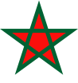

# Currency and Issuer Chart Markers #

**This page of the documentation contains almost 500 different images. 
Sometimes GitHub seems to be reluctant to serve so many images ([bug](https://github.com/orgs/community/discussions/106686) [reports](https://github.com/jdaw1/chart_markers/issues/15)). 
When that happens, readers might prefer an [HTML translation of this page](http://www.jdawiseman.com/papers/Chart_Markers/ChartMarkers_Gallery.html). 
Of course, the HTML version might lag the markdown version.**

Documentation links: 
&#9655;&#xFE0E;&nbsp;Gallery
&#9654;&#xFE0E;&nbsp;[Description](ChartMarkers_Description.md)
&#9654;&#xFE0E;&nbsp;[Code](ChartMarkers_Code.md)
&#9654;&#xFE0E;&nbsp;[Grumbles](ChartMarkers_Grumbles.md)
&#9654;&#xFE0E;&nbsp;[Files](ChartMarkers_Files.md) incl. [JSON data asset](../ChartMarkers.json) ([raw](https://raw.githubusercontent.com/jdaw1/chart_markers/main/ChartMarkers.json))

--- 

## Introduction ##

Charts in financial markets are a mess: $ or &euro; or &pound; or &yen; might be represented by different symbols on different charts. 
Indeed, sometimes different symbols in charts created by the same author and appearing on the same page.

A consistent set of markers would allow readers to focus more on the meaning of the data, and less on the distraction of attempting to decode the markers. 
Such a set of markers has been made, showcased on this page.

If you and you alone use it, then you would be consistent for your readers: a good thing. 
If others also use it, it would be even easier for your readers: even better. 
And it&rsquo;s free, released under the very permissive [Boost Software Licence, Version&nbsp;1.0](http://opensource.org/license/bsl-1-0/).

Alas, GitHub&rsquo;s rendering of the markdown seems to shrink some of the wide SVGs. To compare sizes better, open images in a new tab.

## Markers ##

 
 
 
 
 
 
 
 
 
&nbsp;&nbsp;&nbsp; 
 
 
 
 
 
 
 
 
 
 
 
 
 
 
 
 
 

&nbsp;&nbsp;&nbsp; 
 
 
 
 
 
 
&nbsp;&nbsp;&nbsp; 
 
 
 
 
 
 
 
 
 
&nbsp;&nbsp;&nbsp; 
 
 
 
 
 
 
 
 
 
 
 
 
 
 
 
 
 
&nbsp;&nbsp;&nbsp; 
 
 
 
 
 
 
 
 
 
 
 
 

&nbsp;&nbsp;&nbsp; 
 
 
 
 
 
 
 
 
 
 
 
 
 
 
 
 
 
 
 
&nbsp;&nbsp;&nbsp; 
 
 
 
 
 
 
 
 
 
 
 
 
 
 
 
 
 
 
 
 
 
 
 
 
 
&nbsp;&nbsp;&nbsp; 
 
 
 
 
 
 
 
 
 
 
 
 
 
 
 
 
&nbsp;&nbsp;&nbsp; 
 
 

## Gallery ##

Internal links: 
&bull;&#8239;[Main&nbsp;Developed&nbsp;Currencies](#main_developed_currencies); 
&bull;&#8239;[Asia](#asia); 
&bull;&#8239;[Western&nbsp;and&nbsp;Central&nbsp;Europe,&nbsp;non&#x2011;&euro;](#western_central_europe); 
&bull;&#8239;[Balkans,&nbsp;Caucasus,&nbsp;Eastern&nbsp;Europe](#balkans_caucasus_eastern_europe); 
&bull;&#8239;[Middle&nbsp;East&nbsp;and&nbsp;North&nbsp;Africa](#middle_east_north_africa); 
&bull;&#8239;[Africa](#africa); 
&bull;&#8239;[Americas](#americas); 
&bull;&#8239;[Euro&nbsp;Zone](#euro_zone); 
&bull;&#8239;[Development&nbsp;Banks](#development_banks); 
&bull;&#8239;[Precious&nbsp;Metals](#precious_metals). Also grouped 
&loz;&#8239;[by outer shape](#by_shape); and 
&loz;&#8239;[by colour](#by_colour).

| &nbsp;ID&nbsp; | &nbsp;Actual&nbsp; size | &nbsp;Enlarged&nbsp;up&nbsp;to&nbsp;8&#8239;&times; | &nbsp;&nbsp;&nbsp;Explanation, &lsquo;story&rsquo;, comment, etc | [Line](ChartMarkers_Description.md#lines) Outer Inner |
|:--------------:|:--------------------------:|:-------------------------------:|:------------------------------------------------------------------------|:----:|
|  |  |  | <h2>&nbsp;&nbsp;&nbsp;&nbsp;&nbsp;<a name="main_developed_currencies">Main Developed Currencies</a></h2> | |
| USD |  |  | 
Star from [flag](http://en.wikipedia.org/wiki/Flag_of_the_United_States); thick black edge so that most important currency has maximum contrast. Slightly larger than other markers, as it is the most important currency.

The bounding box of the SVG is not tight to the star. Instead it is the tightest bounding box such that the box and the star have the same centres (and likewise for all markers of which the perimeter has odd-order rotational symmetry). The Code page has an [explanation with diagrams](ChartMarkers_Code.md#centres).
 |  000000 |
| EUR |  |  | 
[Currency symbol](http://en.wikipedia.org/wiki/File:Euro_Construction.svg) =&nbsp;&euro;, with the circle completed; the two lines across simplified to one, placed between the original two. Pink not in any of member flags, so is a neutral choice, and is helpfully distinctive. Indeed, for these reasons pink has been my colour for the euro since before it started: the colour is sanctified by antiquity.

The markers for the [EU](#EU) and the [_ECB](#\_ECB) are derived from that for the currency. [Below](#euro_zone) are those for the euro-zone issuers.
 |  FF33FF |
| GBP |  |  | 
Only large currency with prominent diagonal cross in [flag](http://www.jdawiseman.com/papers/union-jack/union-jack.html), though the diagonal has been thickened. In [flag](http://en.wikipedia.org/wiki/Union_Jack) red and blue.

Sometimes data is reported for England and/or Scotland, rather than for the UK as a whole ([e.g.](http://twitter.com/jdaw1/status/1665068365403115520)), and some sports are organised at the same level (summary: it&rsquo;s complicated). So there are same-shape markers for the UK&rsquo;s immediately sub-national divisions: England&nbsp;=&nbsp;GB_ENG&nbsp;=&nbsp;&nbsp;; Scotland&nbsp;=&nbsp;GB_SCT&nbsp;=&nbsp;&nbsp;; Wales&nbsp;=&nbsp;GB_WLS&nbsp;=&nbsp;&nbsp;; Northern&nbsp;Ireland&nbsp;=&nbsp;GB_NIR&nbsp;=&nbsp;&nbsp;; and the jurisdiction England & Wales&nbsp;=&nbsp;GB_EAW&nbsp;=&nbsp; (the last of these being standard for green gilts and for [old&#8209;style 8&#8209;month ILGs](http://www.jdawiseman.com/papers/finmkts/gilt_statics_non-conventionals.html#ILG_8M)).
 |  012169 |
| JPY |  |  | From the [flag of Japan](http://en.wikipedia.org/wiki/Flag_of_Japan#Design). |  EF3340 |
| CHF |  |  | 
From the [flag of Switzerland](http://en.wikipedia.org/wiki/Flag_of_Switzerland#Design).

Switzerland has an alternate marker, <nobr>&nbsp;=&nbsp;CHF_2,</nobr> which can be used for green bonds, or for other purposes.
 |  FF0000 FFFFFF |
| CAD |  |  | 
Three-lobed [Canada maple leaf](http://commons.wikimedia.org/wiki/File:Flag_of_Canada_(construction_sheet_-_leaf_geometry).svg), vigorously symmetrified, in the red and white [national colours of Canada](http://en.wikipedia.org/wiki/National_colours_of_Canada). The line colours are red and black, taken from the colours of the [Canadian National Men&rsquo;s Hockey Team](http://en.wikipedia.org/wiki/Canada_men's_national_ice_hockey_team).

Canada has an alternate marker, <nobr>&nbsp;=&nbsp;CAD_2,</nobr> which can be used for green bonds, or for other purposes.
 |  FF0000 000000 |
| AUD |  |  | A seven pointed star with inner radius =&nbsp;4&frasl;9, from the Australian [flag](http://en.wikipedia.org/wiki/Flag_of_Australia#Construction), in the green and gold [national colours of Australia](http://en.wikipedia.org/wiki/National_colours_of_Australia). |  00843D FFCD00 |
| NZD |  |  | Five-pointed star from the [flag of New Zealand](http://en.wikipedia.org/wiki/Flag_of_New_Zealand#Specifications). |  012169 C8102E |
| SEK |  |  | From the [flag of Sweden](http://en.wikipedia.org/wiki/Flag_of_Sweden). |  004B87 FFD100 |
| NOK |  |  | From the [flag of Norway](http://en.wikipedia.org/wiki/Flag_of_Norway). |  BA0C2F 00205B |
|  |  |  | <h2>&nbsp;&nbsp;&nbsp;&nbsp;&nbsp;<a name="asia">Asia</a></h2> | |
| CNY |  |  | 
The five-pointed star on the [flag of the People&rsquo;s Republic of China](http://en.wikipedia.org/wiki/Flag_of_China#Construction_details,_sizes_and_colors) that has the least vertical orientation: second down of smalls, rotation =&nbsp;ArcTan[&minus;7/&minus;1] &asymp;&#8239;98.13&deg;.

To confirm that the rotation is correct just before final closing tag insert &ldquo;`<g stroke-width='0.2' stroke='black' opacity='25%' fill='none'><path d='M 7 -1 L -14 2'/><circle r='0.4'/></g>`&rdquo;. &exist;&nbsp;[comment re centre](ChartMarkers_Code.md#centres).
 |  DE2910 FFDE00 |
| HKD |  |  | The five-leaf pattern of the [flag of Hong Kong](http://en.wikipedia.org/wiki/Flag_of_Hong_Kong), simplified to a pentagon, double-edged like the logo of the [HKMA](http://www.hkma.gov.hk/eng/) = Hong Kong Monetary Authority. |  FF0000 |
| TWD |  |  | From the [flag of Taiwan = Republic of China](http://en.wikipedia.org/wiki/Flag_of_the_Republic_of_China). Alas a twelve-pointed star is a blur when shown as small as a chart marker. |  0029CC FFFFFF |
| KRW |  |  | From the [flag of South Korea](http://en.wikipedia.org/wiki/Flag_of_South_Korea). The shape, but not the colour, has the desired rotational symmetry. |  CD2E3A 0047A0 |
| SGD |  |  | White star from the [flag of Singapore](http://en.wikipedia.org/wiki/Flag_of_Singapore); circle and colour from logo of [MAS](http://www.mas.gov.sg/) = Monetary Authority of Singapore. |  A78337 |
| MYR |  |  | Star from the [flag of Malaysia](http://web.archive.org/web/20120318034534/http://pmr.penerangan.gov.my/index.php/maklumat-kenegaraan/194-bendera-malaysia.html), simplified from 14 outer points to 14 vertices (i.e., 7 outer points). The rectangle has rotational symmetry of order 2, the star of order 7, with the same centres, but the whole does not have rotational symmetry. |  00326A DECE05 |
| IDR |  |  | From the [flag of Indonesia](http://en.wikipedia.org/wiki/Flag_of_Indonesia). |  FF0000 FFFFFF |
| THB |  |  | From the [flag of Thailand](http://en.wikipedia.org/wiki/Flag_of_Thailand). |  FE0000 010080 |
| MMK |  |  | From the [flag of Myanmar](http://en.wikipedia.org/wiki/Flag_of_Myanmar). |  34B233 FECB00 |
| PHP |  |  | Big star from the [flag of the Philippines](http://en.wikipedia.org/wiki/Flag_of_the_Philippines#Construction), simplified, in flag gold and blue. |  0038A8 FCD116 |
| VND |  |  | Banded oval from logo of [State Bank of Vietnam](http://www.sbv.gov.vn/webcenter/portal/en/); colours from [flag](http://en.wikipedia.org/wiki/Flag_of_Vietnam). |  FFFF00 DA251D |
| INR |  |  | [Ashoka Chakra](http://en.wikipedia.org/wiki/Ashoka_Chakra) from the [flag of India](http://en.wikipedia.org/wiki/Flag_of_India), simplified, in original navy blue. |  250E62 FFFFFF |
| PKR |  |  | 
From the [flag of Pakistan](http://en.wikipedia.org/wiki/Flag_of_Pakistan), five-pointed star rotated by ArcTan[9/8] &asymp;&nbsp;48.366&deg;.

To confirm that the rotation is correct just before final closing tag insert &ldquo;`<g stroke-width='0.2' stroke='black' opacity='25%' fill='none'><path d='M 11.25 -10 L -11.25 10'/><circle r='0.4'/></g>`&rdquo;. &exist;&nbsp;[comment re centre](ChartMarkers_Code.md#centres).
 |  01411C FFFFFF |
| BDT |  |  | From the [flag of Bangladesh](http://en.wikipedia.org/wiki/Flag_of_Bangladesh). |  006A4E F42A41 |
| LKR |  |  | [Flag of Sri Lanka](http://en.wikipedia.org/wiki/Flag_of_Sri_Lanka), much simplified. |  79052C FDB221 |
| NPR |  |  | Two triangles, back to back, from the shape of the [flag of Nepal](http://en.wikipedia.org/wiki/Flag_of_Nepal), and inside two white triangles, from the rays of the sun and moon. |  DC143C 000000 |
| KZT |  |  | [Flag of Kazakhstan](http://en.wikipedia.org/wiki/Flag_of_Kazakhstan), simplified and rearranged. |  00AEC7 F6E500 |
| UZS |  |  | Colours and pieces from the [flag of Uzbekistan](http://en.wikipedia.org/wiki/Flag_of_Uzbekistan): crescent moon duplicated for symmetry, and a star. |  1EB53A 0099B5 |
| TMT |  |  | From the [emblem of Turkmenistan](http://en.wikipedia.org/wiki/Emblem_of_Turkmenistan). |  FFC72C 00853A |
| MNT |  |  | A symmetrified part of the [Soyombo symbol](http://en.wikipedia.org/wiki/Soyombo_symbol) in the [flag of Mongolia](http://en.wikipedia.org/wiki/Flag_of_Mongolia). The line uses blue from the flag, as red-yellow combinations taken by [CNY](#CNY) and [VND](#VND). |  0066B3 DA2032 |
| KPW |  |  | From the [flag of North Korea](http://en.wikipedia.org/wiki/Flag_of_North_Korea). The line uses black instead of white, as allowed {white, red, blue} combinations taken by countries with higher GDP. |  000000 ED1C27 |
|  |  |  | <h2>&nbsp;&nbsp;&nbsp;&nbsp;&nbsp;<a name="western_central_europe">Western and Central Europe, non&#x2011;&euro;</a></h2> | |
| DKK |  |  | From flags of [Denmark](http://en.wikipedia.org/wiki/Flag_of_Denmark) and [Greenland](http://en.wikipedia.org/wiki/Flag_of_Greenland). |  DA291C FFFFFF |
| ISK |  |  | From the [flag of Iceland](http://en.wikipedia.org/wiki/Flag_of_Iceland). |  02529C DC1E35 |
| PLN |  |  | From [naval jack of Poland](http://en.wikipedia.org/wiki/List_of_Polish_naval_and_maritime_flags#/media/File:Naval_Jack_of_Poland.svg); colours from [flag](http://en.wikipedia.org/wiki/Flag_of_Poland). |  D22630 |
| CZK |  |  | Triangle from the hoist of the [Czech flag](http://en.wikipedia.org/wiki/Flag_of_the_Czech_Republic), for symmetry duplicated back-to-back, in flag colours. |  D7141A 11457E |
| HUF |  |  | Cross from [Hungarian coat of arms](http://en.wikipedia.org/wiki/National_symbols_of_Hungary#Flags_and_heraldry), symmetrified and simplified, in green and red from the [flag of Hungary](http://en.wikipedia.org/wiki/Flag_of_Hungary).  |  00843D CE2939 |
| RON |  |  | [Palace of Parliament](http://goo.gl/maps/RQzKYRL8b2pud8Bk8), Bucharest, in [Romanian-flag](http://en.wikipedia.org/wiki/Flag_of_Romania) blue-yellow-red. |  002B7F FCD116 |
| BGN |  |  | [Cathedral Saint Aleksandar Nevski](http://goo.gl/maps/31A83q7KSnGaavy59), in [Bulgarian-flag](http://en.wikipedia.org/wiki/Flag_of_Bulgaria) green. |  00AF66 FFFFFF |
|  |  |  | <h2>&nbsp;&nbsp;&nbsp;&nbsp;&nbsp;<a name="balkans_caucasus_eastern_europe">Balkans, Caucasus, Eastern Europe</a></h2> | |
| RSD |  |  | [Temple of Saint Sava](http://goo.gl/maps/iPTF3w1RwiyL1Ecc8), Belgrade, in [Serbian-flag](http://en.wikipedia.org/wiki/Flag_of_Serbia) blue and red. |  C7363D 0C4077 |
| ALL |  |  | Eagle on [flag of Albania](http://en.wikipedia.org/wiki/Flag_of_Albania#/media/File:Flag_of_Albania.svg): circle from claws, diamond from tail. |  000000 DA291C |
| MKD |  |  | From the [flag of North Macedonia](http://en.wikipedia.org/wiki/Flag_of_North_Macedonia#/media/File:Construction_sheet_of_the_flag_of_North_Macedonia.svg). |  CE2028 F9D616 |
| MDL |  |  | Inspired by the top and side views of the [Romanita Collective Housing Tower](http://socialistmodernism.com/the-romanita-collective-housing-tower-building-chisinau/), [Chi&#537;in&abreve;u](http://en.wikipedia.org/wiki/Chi%C8%99in%C4%83u), in the colours of the [flag of Moldova](http://en.wikipedia.org/wiki/Flag_of_Moldova). |  FFD200 CC092F |
| UAH |  |  | From the [flag of Ukraine](http://en.wikipedia.org/wiki/Flag_of_Ukraine). |  0057B7 FFD700 |
| GEL |  |  | Crosses from the [flag of Georgia](http://en.wikipedia.org/wiki/Flag_of_Georgia_(country)). At the likely size of a marker, the curve in the short sides would cause an indentation of less than a pixel, so those sides have been made straight. |  FF0000 FFFFFF |
| AZN |  |  | From the [National emblem of Azerbaijan](http://en.wikipedia.org/wiki/National_emblem_of_Azerbaijan). |  0098C3 FFFFFF |
| AMD |  |  | Eight-pointed rosette taken from the [flag of the President of Armenia](http://en.wikipedia.org/wiki/Flag_of_Armenia#/media/File:Flag_of_the_President_of_Armenia.svg). |  0033A0 F2A800 |
| BYN |  |  | From pattern in the [flag of Belarus](http://en.wikipedia.org/wiki/Flag_of_Belarus). |  CF101A FFFFFF |
| RUB |  |  | 
Based on the medal [Hero of the Russian Federation](http://en.wikipedia.org/wiki/Hero_of_the_Russian_Federation), measurements from the [wikipedia image](http://upload.wikimedia.org/wikipedia/commons/c/cb/RIAN_archive_470774_Gold_Star_medal_%28cropped%29.jpg) being consistent with an inner radius of 0.527.

For a full-symmetry five-pointed star, area&nbsp;=&nbsp;outer&#8239;&middot;&#8239;inner&#8239;&middot;&#8239;&radic;(10&#8239;&minus;&#8239;2&radic;5)&#8239;&middot;&#8239;5/4, the constant being &asymp;&#8239;2.939. For a regular 5&frasl;2 star the inner radius is &frac12;&#8239;(3&#8239;&minus;&#8239;&radic;5) &asymp;&nbsp;0.382 &DoubleLongRightArrow;&nbsp;with same outer radius this RUB star would have an area &asymp;&nbsp;0.527&#8239;/&#8239;0.382 &asymp;&nbsp;1.38&nbsp;times bigger. Hence it is slighty smaller than the other five-pointed stars.
 |  6A571B D4AF37 |
|  |  |  | <h2>&nbsp;&nbsp;&nbsp;&nbsp;&nbsp;<a name="middle_east_north_africa">Middle East and North Africa</a></h2> | |
| TRY |  |  | From the [flag of T&uuml;rkiye](http://en.wikipedia.org/wiki/Flag_of_Turkey#Dimensions), in English [formerly known as &lsquo;Turkey&rsquo;](http://en.wikipedia.org/wiki/Name_of_Turkey#Presidential_circular_on_use_of_T%C3%BCrkiye). |  E30A17 |
| SAR |  |  | Simplified [flag of Saudi Arabia](http://en.wikipedia.org/wiki/Flag_of_Saudi_Arabia). |  009639 FFFFFF |
| AED |  |  | *Burj Khalifa*, tier 0 [floor plan](http://en.wikipedia.org/wiki/Burj_Khalifa#Architecture_and_design); colours from the [flag of the United Arab Emirates](http://en.wikipedia.org/wiki/Flag_of_United_Arab_Emirates). |  009639 EF3340 |
| OMR |  |  | From the badge of the Albusaidi Dynasty in the hoist of the [flag of Oman](http://en.wikipedia.org/wiki/Flag_of_Oman), with the crossed swords, but without the ornate horsebit, and without the asymmetry of the curved dagger. |  C8102E FFD700 |
| QAR |  |  | From the [flag of Qatar](http://www.vexilla-mundi.com/qatar_flag.html). |  6C1D45 FFFFFF |
| BHD |  |  | From the [flag of Bahrain](http://en.wikipedia.org/wiki/Flag_of_Bahrain). |  DA291C |
| KWD |  |  | Black isosceles trapezium in hoist of [flag of Kuwait](http://en.wikipedia.org/wiki/Flag_of_Kuwait), for symmetry duplicated back-to-back, in flag colours. |  000000 CE1126 |
| YER |  |  | Outer shape inspired by a motif from the Marib Dam in the [emblem of Yemen](http://en.wikipedia.org/wiki/Emblem_of_Yemen), plus extra &lsquo;stones&rsquo; echoing their placement in the [actual Marib Dam](http://en.wikipedia.org/wiki/Marib_Dam). |  C49C5B 000000 |
| JOD |  |  | From the [flag of Jordan](http://en.wikipedia.org/wiki/Flag_of_Jordan). |  CE1126 000000 |
| LBP |  |  | [Flag of Lebanon](http://en.wikipedia.org/wiki/Flag_of_Lebanon), symmetrified. |  EF3340 009639 |
| SYP |  |  | Stars from the [flag of Syria](http://en.wikipedia.org/wiki/Flag_of_Syria), in flag colours. |  007A3D 000000 |
| PS |  |  | Triangle from the hoist of the [flag of Palestine](http://en.wikipedia.org/wiki/Flag_of_Palestine), for symmetry duplicated back-to-back, in flag colours. |  009736 000000 |
| EGP |  |  | Square-based pyramid in [Egyptian-flag](http://en.wikipedia.org/wiki/Flag_of_Egypt) black and white. |  000000 FFFFFF |
| TND |  |  | Star from the [flag of Tunisia](http://en.wikipedia.org/wiki/Flag_of_Tunisia). |  E70013 FFFFFF |
| MAD |  |  | Star from the [flag of Morocco](http://en.wikipedia.org/wiki/Flag_of_Morocco), the bright red being taken from the [coat of arms](http://en.wikipedia.org/wiki/Coat_of_arms_of_Morocco). |  006233 FB0F0C |
| DZD |  |  | All the points of the red star touch the boundary of the green (four inside, one outside), a property of two of the points of the star in the [flag of Algeria](http://en.wikipedia.org/wiki/Flag_of_Algeria) = Dzair. The rectangles have rotational symmetry of order 2, the star of order 5, all with the [same centres](ChartMarkers_Code.md#centres), but the whole does not have rotational symmetry. |  006633 FFFFFF |
| IRR |  |  | Simplified and symmetrified map of [Iran](http://en.wikipedia.org/wiki/Iran#Administrative_divisions), in [flag](http://en.wikipedia.org/wiki/Flag_of_Iran) colours. |  239F40 FFFFFF |
| IQD |  |  | Wings of eagle in the [coat of arms of Iraq](http://en.wikipedia.org/wiki/Coat_of_arms_of_Iraq). |  000000 E3B329 |
| ILS |  |  | Star of David, from the [flag of Israel](http://en.wikipedia.org/wiki/Flag_of_Israel). At the likely size of a marker the six white triangles in the six arms would not be visible, so have been omitted. |  005EB8 FFFFFF |
|  |  |  | <h2>&nbsp;&nbsp;&nbsp;&nbsp;&nbsp;<a name="africa">Africa</a></h2> | |
| ZAR |  |  | Symmetrified [flag](http://en.wikipedia.org/wiki/Flag_of_South_Africa); orange as distinctive South African colour. |  007749 FFA500 |
| NGN |  |  | From the [flag of Nigeria](http://en.wikipedia.org/wiki/Flag_of_Nigeria#Design). |  009639 FFFFFF |
| ETB |  |  | From the 2009 [flag of Ethiopia](http://en.wikipedia.org/wiki/Flag_of_Ethiopia). |  0F47AF FCDD09 |
| SDG |  |  | Inspired by the wings of the [Secretary bird](http://en.wikipedia.org/wiki/Secretary_bird) in the [emblem of Sudan](http://en.wikipedia.org/wiki/Emblem_of_Sudan). |  000000 FFFFFF |
| KYS |  |  | Simplified shield from the [flag of Kenya](http://en.wikipedia.org/wiki/Flag_of_Kenya). |  BB0000 000000 |
| TZS |  |  | From the [flag of Tanzania](http://en.wikipedia.org/wiki/Flag_of_Tanzania), simplified. |  FCD116 000000 |
| UGX |  |  | From the [flag of Uganda](http://en.wikipedia.org/wiki/Flag_of_Uganda). |  000000 D90000 |
| CDF |  |  | From the [flag of the Democratic Republic of the Congo](http://en.wikipedia.org/wiki/Flag_of_the_Democratic_Republic_of_the_Congo). |  007FFF F7D618 |
| GHS |  |  | From the [coat of arms of Ghana](http://en.wikipedia.org/wiki/Ghana#/media/File:Coat_of_arms_of_Ghana.svg). |  000000 FFD100 |
| SN |  |  | From the [flag of Senegal](http://en.wikipedia.org/wiki/Flag_of_Senegal). |  FDEF42 1D6233 |
| GA |  |  | Three circles from the [coat of arms of Gabon](http://en.wikipedia.org/wiki/Gabon#/media/File:Coat_of_arms_of_Gabon.svg), in [flag](http://en.wikipedia.org/wiki/Flag_of_Gabon) green-yellow-blue. |  003DA5 009639 |
| CI |  |  | Circle for sun in [coat of arms of C&ocirc;te d&rsquo;Ivoire (Ivory Coast)](http://en.wikipedia.org/wiki/Coat_of_arms_of_Ivory_Coast), in [flag](http://en.wikipedia.org/wiki/Flag_of_Ivory_Coast) orange-white-green. |  EA7600 009A44 |
| CM |  |  | From the [flag of Cameroon](http://en.wikipedia.org/wiki/Flag_of_Cameroon). |  FCD116 CE1126 |
| AOA |  |  | [Flag of Angola](http://en.wikipedia.org/wiki/Flag_of_Angola): circle for the gear wheel; 36&deg; diagonal for the machete. |  C8102E FFCD00 |
|  |  |  | <h2>&nbsp;&nbsp;&nbsp;&nbsp;&nbsp;<a name="americas">Americas</a></h2> | |
| MXN |  |  | Eight-pointed star from [Mexican naval jack](http://en.wikipedia.org/wiki/Mexican_Navy); [flag](http://en.wikipedia.org/wiki/Flag_of_Mexico) colours. |  006341 C8102E |
| BRL |  |  | Lozenge from the [flag of Brazil](http://en.wikipedia.org/wiki/Flag_of_Brazil#Design), so in ratio 83&ratio;53 &DoubleLongRightArrow;&nbsp;sharp angle &asymp;&#8239;65.12&deg;. |  009639 FEDD00 |
| CLP |  |  | From the [flag of Chile](http://en.wikipedia.org/wiki/Flag_of_Chile#Construction). The square has rotational symmetry of order 4, the star of order 5, with the same centres, but the whole does not have rotational symmetry. |  D52B1E 0033A0 |
| COP |  |  | Banded circle from logo of [*Banco de la Rep&uacute;blica de Colombia*](http://www.banrep.gov.co/en/); [flag](http://en.wikipedia.org/wiki/Flag_of_Colombia) colours. |  003087 FFCD00 |
| PEN |  |  | Circle for sun in [early Peruvian flag](http://en.wikipedia.org/wiki/Flag_of_Peru#Flag_of_March_1822), in modern red and white. |  C8102E FFFFFF |
| UYU |  |  | [Flag of Uruguay](http://en.wikipedia.org/wiki/Flag_of_Uruguay) has four blue stripes, two of which have ratio 17&ratio;2. |  7B3F00 FFFFFF |
| ARS |  |  | From the [flag of Argentina](http://en.wikipedia.org/wiki/Flag_of_Argentina). |  6CACE4 FFFFFF |
| BOB |  |  | [Wiphala](http://en.wikipedia.org/wiki/Flag_of_Bolivia#/media/File:Banner_of_the_Qulla_Suyu.svg), dual flag of Bolivia, simplified from 7&times;7 to 5&times;5. |  000000 FFFFFF |
| BZD |  |  | From the [flag of Belize](http://en.wikipedia.org/wiki/Flag_of_Belize). |  1D428A C8102E |
| EC |  |  | Oval from the [coat of arms of Ecuador](http://en.wikipedia.org/wiki/Flag_of_Ecuador#/media/File:Coat_of_arms_of_Ecuador.svg); in [flag](http://en.wikipedia.org/wiki/Flag_of_Ecuador) yellow-blue-red. |  0072CE FFD100 |
| GYD |  |  | Arrowhead and colours from the [flag of Guyana](http://en.wikipedia.org/wiki/Flag_of_Guyana). |  2A936A BE1E2D |
| VED |  |  | Star and colours from the [flag of Venezuela](http://en.wikipedia.org/wiki/Flag_of_Venezuela). |  FCE300 003DA5 |
| SV |  |  | From the [flag of El Salvador](http://en.wikipedia.org/wiki/Flag_of_El_Salvador). |  005EB8 FFFFFF |
| CRC |  |  | From the [flag of Costa Rica](http://en.wikipedia.org/wiki/Flag_of_Costa_Rica). |  000000 DA291C |
| GTQ |  |  | From the [flag of Guatemala](http://en.wikipedia.org/wiki/Flag_of_Guatemala). |  4997D0 FFFFFF |
| PAB |  |  | From the [flag of Panama](http://en.wikipedia.org/wiki/Flag_of_Panama). The square has rotational symmetry of order 4, the star of order 5, with the same centres, but the whole does not have rotational symmetry. |  072357 DA121A |
| DOP |  |  | From the [flag of the Dominican Republic](http://en.wikipedia.org/wiki/Flag_of_the_Dominican_Republic). |  002D62 CE1126 |
| TTD |  |  | From the [flag of Trinidad and Tobago](http://en.wikipedia.org/wiki/Flag_of_Trinidad_and_Tobago). |  C8102E 000000 |
| JMD |  |  | From the [flag of Jamaica](http://en.wikipedia.org/wiki/Flag_of_Jamaica). |  009639 000000 |
| BSD |  |  | Triangle from the hoist of the [flag of the Bahamas](http://en.wikipedia.org/wiki/Flag_of_the_Bahamas), for symmetry duplicated back-to-back, in flag colours. |  FFC72C 00778B |
|  |  |  | <h2 style="margin-bottom: 0;  padding-bottom: 0;">&nbsp;&nbsp;&nbsp;&nbsp;&nbsp;<a name="euro_zone">Euro Zone</a></h2>
For official members ordered by [&ge;&nbsp;2024 capital key](http://www.ecb.europa.eu/press/pr/date/2023/html/ecb.pr231221~173a7ba501.en.html); then unofficial unilateral adopters ordered by GDP.
 | |
| EU |  |  | As for [EUR](#EUR)&nbsp;=&nbsp;&euro;, except the horizontal line replaced by a star from the [flag of Europe](http://en.wikipedia.org/wiki/Flag_of_Europe), which is used as the flag of the European Union. |  FF33FF FFFFFF |
| \_ECB |  |  | As for [EUR](#EUR)&nbsp;=&nbsp;&euro;, except with two horizontal lines. |  000000 FF33FF |
| DE |  |  | 
Simplified from six to four columns, the [Brandenburg Gate](http://en.wikipedia.org/wiki/Brandenburg_Gate), in Berlin, Germany.

Germany has an alternate marker, <nobr>&nbsp;=&nbsp;DE_2,</nobr> which can be used for green bonds, for the (now former) East Germany, or for other purposes.
 |  000000 FFFFFF |
| FR |  |  | 
[Hexagonal shape of France](http://en.wikipedia.org/wiki/Outline_of_France); in blue-white-red of [flag](http://en.wikipedia.org/wiki/Flag_of_France).

France has an alternate marker, <nobr>&nbsp;=&nbsp;FR_2.</nobr> It can be used for green bonds or for [OATi](http://www.aft.gouv.fr/en/encours-detaille-oati) linked to French inflation (e.g. [0.55% Mar&nbsp;2039](http://www.aft.gouv.fr/en/titre/fr001400ikw5)), with the usual marker, <nobr>&nbsp;=&nbsp;FR</nobr>, being used for non-green or for [OAT&euro;i](http://www.aft.gouv.fr/en/encours-detaille-oatei) linked to European inflation (e.g. [0.1% July&nbsp;2053](http://www.aft.gouv.fr/en/titre/fr0014008181)). Of course, the alternate marker can be used for other purposes.
 |  0055A4 EF4135 |
| IT |  |  | 
Rome&rsquo;s [Colosseum](http://en.wikipedia.org/wiki/Colosseum), in the colours of the [flag of Italy](http://en.wikipedia.org/wiki/Flag_of_Italy).

Italy has an alternate marker, <nobr>&nbsp;=&nbsp;IT_2,</nobr> which can be used for green bonds, or for southern Italy when that is being distinguished, or for other purposes.
 |  008C45 CD212A |
| ES |  |  | 
From the [flag of Spain](http://en.wikipedia.org/wiki/Flag_of_Spain).

Spain has an alternate marker, <nobr>&nbsp;=&nbsp;ES_2,</nobr> which can be used for green bonds, or for other purposes.
 |  AD1519 FABD00 |
| NL |  |  | 
[Netherlands naval jack](http://en.wikipedia.org/wiki/Flag_of_the_Netherlands), in Dutch orange.

The Netherlands has an alternate marker, <nobr>&nbsp;=&nbsp;NL_2,</nobr> which can be used for green bonds, or for other purposes.
 |  003DA5 FA9B1E |
| BE |  |  | 
From above, simplified, dome of [Palais de Justice](http://www.youtube.com/watch?v=YuFCixRYD7c) in Brussels, Belgium.

Belgium has an alternate marker, <nobr>&nbsp;=&nbsp;BE_2,</nobr> which can be used for green bonds, or for other purposes.
 |  663319 FFCC33 |
| AT |  |  | 
From the [flag of Austria](http://en.wikipedia.org/wiki/Flag_of_Austria).

Austria has an alternate marker, <nobr>&nbsp;=&nbsp;AT_2,</nobr> which can be used for green bonds, or for other purposes.
 |  C8102E FFFFFF |
| PT |  |  | 
[National Cockade of Portugal](http://en.wikipedia.org/wiki/National_symbols_of_Portugal#Vexillology), simplified.

Portugal has an alternate marker, <nobr>&nbsp;=&nbsp;PT_2,</nobr> which can be used for green bonds, or for other purposes.
 |  DA291C 046A38 |
| GR |  |  | 
From the [flag of Greece](http://en.wikipedia.org/wiki/Flag_of_Greece).

Greece has an alternate marker, <nobr>&nbsp;=&nbsp;GR_2,</nobr> which can be used for green bonds, or for other purposes.
 |  004C98 FFFFFF |
| IE |  |  | 
[Shamrock](http://en.wikipedia.org/wiki/Shamrock), in green and orange from the [flag of Ireland](http://en.wikipedia.org/wiki/Flag_of_Ireland).

Ireland has an alternate marker, <nobr>&nbsp;=&nbsp;IE_2,</nobr> which can be used for green bonds, or for other purposes.
 |  FF883E 169B62 |
| FI |  |  | 
From the [flag of Finland](http://en.wikipedia.org/wiki/Flag_of_Finland).

Finland has an alternate marker, <nobr>&nbsp;=&nbsp;FI_2,</nobr> which can be used for green bonds, or for other purposes.
 |  002F6C |
| SK |  |  | 
Cross from the [flag of Slovakia](http://en.wikipedia.org/wiki/Flag_of_Slovakia), symmetrified and simplified.

Slovakia has an alternate marker, <nobr>&nbsp;=&nbsp;SK_2,</nobr> which can be used for green bonds, or for other purposes.
 |  EF3340 034DA3 |
| HR |  |  | From the coat of arms on the [flag of Croatia](http://en.wikipedia.org/wiki/Flag_of_Croatia), simplified. A similiar pattern appears on the kit of [Croatia&rsquo;s football team](http://en.wikipedia.org/wiki/Croatia_at_the_FIFA_World_Cup#/media/File:Croatia_WC2018_final.jpg). |  FF0000 000000 |
| LT |  |  | Cross from [State Flag of Lithuania](http://en.wikipedia.org/wiki/Flag_of_Lithuania#/media/File:Flag_of_Lithuania_(state).svg), in colours of [flag of Lithuania](http://en.wikipedia.org/wiki/Flag_of_Lithuania). |  006A44 FDB913 |
| SI |  |  | Star from Slovenia&rsquo;s [flag](http://en.wikipedia.org/wiki/Flag_of_Slovenia)&rsquo;s [coat of arms](http://en.wikipedia.org/wiki/Slovenia#/media/File:Coat_of_arms_of_Slovenia.svg). There does not seem to be an official specification of the inner radius of the star; the [wikimedia](http://upload.wikimedia.org/wikipedia/commons/8/8f/Coat_of_arms_of_Slovenia.svg) version uses an inner radius of &frac12;, also used here. |  0060FF FFE600 |
| LV |  |  | From the [naval jack of Latvia](http://www.mil.lv/vienibas/juras-speki/juras-speku-stabs). |  9D2235 FFFFFF |
| LU |  |  | Based on the pediments of the ground floor of [Luxembourg City Hall](http://en.wikipedia.org/wiki/Luxembourg_City_Hall); in [flag](http://en.wikipedia.org/wiki/Flag_of_Luxembourg) colours. The [wikipedia picture](http://en.wikipedia.org/wiki/Luxembourg_City_Hall#/media/File:Luxemb_City_Hotel_de_ville_01.jpg) suggested an aspect ratio of 4&ratio;9, [trimmed](ChartMarkers_Description.md#aspect) to 1&ratio;2. |  EF3340 00A3E0 |
| EE |  |  | Colours from the [flag of Estonia](http://en.wikipedia.org/wiki/Flag_of_Estonia); round for the towers in the [Walls of Tallinn](http://en.wikipedia.org/wiki/Walls_of_Tallinn). |  0072CE 000000 |
| CY |  |  | Two symmetrified olive leaves from the [flag of Cyprus](http://en.wikipedia.org/wiki/Flag_of_Cyprus), in flag &lsquo;copper&rsquo; and green. |  D57800 4E5B31 |
| MT |  |  | Cross of Malta, from its [&lsquo;Variant&rsquo; flag](http://en.wikipedia.org/wiki/Flag_of_Malta#/media/File:Civil_Ensign_of_Malta.svg). |  CF142B C0C0C0 |
| XK |  |  | 
Simplified [flag of Kosovo](http://en.wikipedia.org/wiki/Flag_of_Kosovo).

The [XK](http://en.wikipedia.org/wiki/XK_(user_assigned_code)) identifier isn&rsquo;t official [ISO&nbsp;3166&#8209;1](http://en.wikipedia.org/wiki/ISO_3166-1_alpha-2), but is (or has been) used in that style by the [UK](http://www.gov.uk/government/publications/uk-trade-tariff-country-and-currency-codes/uk-trade-tariff-country-and-currency-codes), [Canada](http://www.cbsa-asfc.gc.ca/prog/cers-scde/ch25/eccrdcers-deccescde-20-eng.html), the [US&nbsp;Department of State](http://xk.usembassy.gov/), [Switzerland](http://www.bazg.admin.ch/bazg/de/home/information-firmen/befreiungen--verguenstigungen--zollpraeferenzen-und-ausfuhrbeitr/einfuhr-in-die-schweiz/entwicklungslaender-aps-gsp--generalized-system-of-preferences-/visumsstellen-fuer-form-a/europa.html), the [European Commission](http://ec.europa.eu/eurostat/statistics-explained/index.php?title=Glossary:Country_codes), the [Deutsche Bundesbank](http://www.bundesbank.de/resource/blob/825312/daf1dfd5cba969a651eed5c410a4fe43/mL/2020-04-codes-data.pdf), [Ireland](http://www.revenue.ie/en/customs/documents/electronic/aep-trader-guide-appendix-4.pdf), [France](http://www.douane.gouv.fr/fiche/liste-des-accords-et-preferences-unilaterales-de-lunion-europeenne#Balkans), [Malta](http://customs.gov.mt/docs/default-source/business-library-(authorised-economic-operators)/country-codes-new.pdf), the [People&rsquo;s Republic of China](http://www.mof.gov.cy/mof/customs/customs.nsf/All/5AF08F6CEE8A4408422577B20041642A/$file/1%20ICS%20Country%20codes.pdf), and others. (Contrariwise, [US&nbsp;Customs](http://www.cbp.gov/sites/default/files/assets/documents/2021-Jan/ACE%20AESTIR%20Appendix%20C%20_01142021_508C.pdf) uses &lsquo;KV&rsquo;.)

Separately, the shade of blue is different to that in a [picture in the *Financial&nbsp;Times*](http://www.ft.com/__origami/service/image/v2/images/raw/https%3A%2F%2Fd1e00ek4ebabms.cloudfront.net%2Fproduction%2F2b0688ec-23cd-4fbe-bb1d-fc6c9324a235.jpg?source=next), about which I [commented](http://www.ft.com/content/0adb2fb9-9f9f-4a56-b0f0-3fce08456cd3?commentID=eb191c09-dfd4-4cc2-bd10-737d3d6d5799).
 |  000000 D0A650 |
| ME |  |  | *Globus crucifer azure crossed Or*, from the [coat of arms of Montenegro](http://en.wikipedia.org/wiki/Coat_of_arms_of_Montenegro#/media/File:Coat_of_arms_of_Montenegro.svg). |  215F8F D3AE45 |
| \_ESM |  |  | [Logo](http://www.esm.europa.eu/themes/custom/esm_wop_theme/logo.svg) of the [European Stability Mechanism](http://www.esm.europa.eu/), simplified and symmetrified. Bloomberg&nbsp;ticker&nbsp;=&nbsp;<kbd>ESM&nbsp;Corp</kbd> |  FFD500 004494 |
| \_EFSF |  |  | The marker of the [European Financial Stability Facility](http://en.wikipedia.org/wiki/European_Financial_Stability_Facility) has the same shape as that of the [\_ESM](#_ESM), as the two share staff and premises. The EFSF is a Luxembourg company, from the flag of which come the colours (whereas the ESM is an intergovernmental institution). They are different entities with different credit ratings, so must have different markers. EFSF&rsquo;s Bbg&nbsp;ticker&nbsp;=&nbsp;<kbd>EFSF&nbsp;Corp</kbd> |  00A3E0 EF3340 |
|  |  |  | <h2>&nbsp;&nbsp;&nbsp;&nbsp;&nbsp;<a name="development_banks">Development Banks</a></h2> | |
| \_EIB |  |  | The [logo of the European Investment Bank](https://www.eib.org/en/stories/eib-new-logo) includes an arch, referring to the building, which seems to be about a third of a 5&ratio;4 ellipse. The marker is the whole ellipse, with horizonal lines to further echo the logo, in logo colours. (Discussion in [issue&nbsp;16](https://github.com/jdaw1/chart_markers/issues/16).) Bbg&nbsp;ticker&nbsp;=&nbsp;<kbd>EIB&nbsp;Corp</kbd> |  003399 9D9D9C |
| \_EBRD |  |  | Simplified [logo](http://www.ebrd.com/images/ebrd-sprite.png) of [European Bank for Reconstruction and Development](http://www.ebrd.com/). Bbg&nbsp;ticker&nbsp;=&nbsp;<kbd>EBRD&nbsp;Corp</kbd> |  0A6AAA FFFFFF |
| \_CoEDB |  |  | From logo of the [Council of Europe Development Bank](http://coebank.org/en/). Bbg&nbsp;ticker&nbsp;=&nbsp;<kbd>COE&nbsp;Corp</kbd> |  092251 FFFFFF |
| \_NIB |  |  | &lsquo;N&rsquo; from the [logo](http://www.nib.int/icons/nib-logo.svg) of the [Nordic Investment Bank](http://www.nib.int/), slightly simplified; dark blue from logo, pale blue from website. Bbg&nbsp;ticker&nbsp;=&nbsp;<kbd>NIB&nbsp;Corp</kbd> |  165788 C3DCF4 |
| \_KfW |  |  | Based on the &lsquo;K&rsquo; of the [logo](http://www.kfw.de/Technische-Medien/Logos/kfw_logo_320-2x.svg) of the [Kreditanstalt f&uuml;r Wiederaufbau](http://www.kfw.de/kfw.de-2.html) (&lsquo;Credit Institute for Reconstruction&rsquo;). Bbg&nbsp;ticker&nbsp;=&nbsp;<kbd>KFW&nbsp;Corp</kbd> |  1B618C |
| \_CADES |  |  | Based on the &lsquo;C&rsquo; of the [logo](http://www.cades.fr/templates/shaper_helixultimate-2021/images/presets/preset2/logo-en.svg) of the [*Caisse d&rsquo;Amortissement de la Dette Sociale*](http://www.cades.fr/en/). Bbg&nbsp;ticker&nbsp;=&nbsp;<kbd>CADES&nbsp;Corp</kbd> |  273375 E20613 |
| \_ADB |  |  | [Unity logo of annual meetings](http://lnadbg6.adb.org/sec0084p.nsf/Content/2016/topics/chapter_3._branding,_logo,_and_visual_identity_guidelines?openDocument) of the [Asian Development Bank](http://www.adb.org/). Bbg&nbsp;ticker&nbsp;=&nbsp;<kbd>ASIA&nbsp;Corp</kbd> |  1C3060 |
| \_AIIB |  |  | From [logo](http://www.aiib.org/_common/base/img/logo-aiib.svg) of [Asian Infrastructure Investment Bank](http://www.aiib.org/en/). Bbg&nbsp;ticker&nbsp;=&nbsp;<kbd>AIIB&nbsp;Corp</kbd> |  860C14 FFFFFF |
| \_IsDB |  |  | From [logo](http://en.wikipedia.org/wiki/Islamic_Development_Bank#/media/File:Islamic_Development_Bank_logo.svg) of the [Islamic Development Bank](http://www.isdb.org/). Bbg&nbsp;ticker&nbsp;=&nbsp;<kbd>ISDB&nbsp;Corp</kbd> |  039355 FFFFFF |
| \_AfDB |  |  | From [logo](http://www.afdb.org/sites/default/files/afdb_logo_en_1.jpg) of the [African Development Bank](http://www.afdb.org/). Bbg&nbsp;ticker&nbsp;=&nbsp;<kbd>AFDB&nbsp;Corp</kbd> |  000000 039355 |
| \_AfExIm |  |  | From [logo](http://www.afreximbank.com/wp-content/themes/afrexim/assets/favicons/coast-228x228.png) of [Afreximbank](http://www.afreximbank.com/) = Africa Export-Import Bank. Bbg&nbsp;ticker&nbsp;=&nbsp;<kbd>AFEXI&nbsp;Corp</kbd> |  198D66 FCB90E |
| \_IADB |  |  | Rearranged [logo](http://pbs.twimg.com/profile_images/1226897864263118848/a6Q8-_nS_200x200.png) of the [Inter-American Development Bank](http://www.iadb.org/en). Bbg&nbsp;ticker&nbsp;=&nbsp;<kbd>IADB&nbsp;Corp</kbd> |  005073 FFFFFF |
| \_BCIE |  |  | From [logo](http://bcie.org/typo3conf/ext/bcie_package/Resources/Public/Images/logo-bcie-2021.png) of [Banco Centroamericano de Integraci&oacute;n Econ&oacute;mica](http://bcie.org/) = Central American Bank for Economic Integration. Bbg&nbsp;ticker&nbsp;=&nbsp;<kbd>CABEI&nbsp;Corp</kbd> |  2BCE75 0046C2 |
| \_CDB |  |  | From [logo](http://www.caribank.org/themes/custom/cdb/logo.svg) of the [Caribbean Development Bank](http://www.caribank.org/). Bbg&nbsp;ticker&nbsp;=&nbsp;<kbd>CARDEV&nbsp;Corp</kbd> |  EFBE20 0B5CAE |
| \_NDB |  |  | Simplified [logo](http://www.ndb.int/wp-content/uploads/2017/02/logo-2.png) of the [BRICS](http://en.wikipedia.org/wiki/BRICS)&rsquo; [New Development Bank](http://www.ndb.int/). Bbg&nbsp;ticker&nbsp;=&nbsp;<kbd>NEWDEV&nbsp;Corp</kbd> |  056839 BED62F |
| \_IBRD |  |  | 
[World Bank](http://www.worldbank.org/) = [International Bank for Reconstruction and Development](http://www.worldbank.org/en/who-we-are/ibrd) = IBRD, [&le;2014&nbsp;logo](http://openknowledge.worldbank.org/bitstream/handle/10986/18237/9781464801631.pdf) (as newer logo not symmetrical). Bbg&nbsp;ticker&nbsp;=&nbsp;<kbd>IBRD&nbsp;Corp</kbd>

A possible simplification of the \_IBRD marker is discussed in [issue&nbsp;11](http://github.com/jdaw1/chart_markers/issues/11).
 |  000000 FFFFFF |
| XDR |  |  | Inspired by the &lsquo;I&rsquo; in the [logo](http://www.imf.org/-/media/Images/IMF/Data/imf-seal-shadow-sep2019-update-svg.ashx) of the [International Monetary Fund](http://www.imf.org/en/), which issues XDR = [Special drawing rights](http://en.wikipedia.org/wiki/Special_drawing_rights). Can be used as a marker for the IMF itself. |  004C97 |
|  |  |  | <h2>&nbsp;&nbsp;&nbsp;&nbsp;&nbsp;<a name="precious_metals">Precious Metals</a></h2> |
| XAU |  |  | Two gold bars, width&ratio;height at 2&ratio;1, undercut &asymp;&#8239;15&deg;, these from the centres of allowed ranges in the [Good Delivery rules](http://www.lbma.org.uk/publications/good-delivery-rules/technical-specifications). Stacked as pictured by the BBC in [Bank of England gold: Rare look inside the vaults](http://www.bbc.co.uk/news/av/uk-51416500), 10&nbsp;Feb&nbsp;2020. Also, this stacking hints at the shape of an &lsquo;X&rsquo;, as in XAU. |  996515 D4AF37 |
| XAG |  |  | Two silver bars, width&ratio;height at 13&ratio;8, undercut &asymp;&#8239;10&deg;, these from the centres of allowed ranges in the [Good Delivery rules](http://www.lbma.org.uk/publications/good-delivery-rules/technical-specifications); stacked as for [XAU](#XAU). |  5C5C5C C0C0C0 |
| XPT |  |  | In the proportions of a [Royal Mint Refinery 1kg platinum bar](https://web.archive.org/web/20210515224532/https://www.royalmint.com/invest/bullion/bullion-bars/platinum-bars/1-kg-platinum-bar-minted/), edged with the [colour](http://goldrefiningforum.com/threads/colours-of-pt-and-pd-compounds.31666/) of H&#8322;PtCl&#8326; = [hexachloroplatinic acid](http://en.wikipedia.org/wiki/Chloroplatinic_acid). |  D95B14 C7C7C7 |

   The next two sections were originally intended to help find visual similarities; and the line section was added later for a similar purpose. 
The categories and orderings are not well-defined: some rearrangements would have been equally performant. 
But it doesn&rsquo;t matter: this is merely a presentation of the data, not part of the definition.

## Grouped by outer shape ##

Rectangle, &asymp;: 
 
 
 
 
 
 
 
 
 
 
 
 
 
 
 
 
 
 
 
 
 
 
 
 
 
 
 
 
 
 
 
 
 
 
 
 
 
 
 
 
 
 
 
 
 
 
 
 
 

Rhombus, &asymp;: 
 
 
 
 
 
 
 
 

  

Circle, &asymp;: 
 
 
 
 
 
 
 
 
 
 
 
 
 
 
 
 
 
 
 
 
 
 
 
 
 
 
 

 
 
 
 
 
 
 
 
 
 
 
 
 
 
 
 
 
 
 
 
 
 
 

Star: 
 
 
 
 
 
 
 
 
 
 
 
 
 
 
 
 
&nbsp;&nbsp; 
Cross: 
 
 
 
 
 
 
 
 
 
 
 
&nbsp;&nbsp; 
Three: 
 
 
 
&nbsp;&nbsp; 
Other: 
 
 

## Grouped by colour ##

Black: 
 
 
 
 
 
 
&nbsp;&nbsp; 
Metal: 
 
 
 
&nbsp;&nbsp; 
Pink: 
 
 

Blue:
 
 
 
 
 
 
 
 
 
 
 
 
 
 
 
&nbsp;&nbsp; 
Blue + red: 
 
 
 
 
 
 
 
 
 
 
 
 
 
 
 
 
 
 
 
 
 

Yellow or orange&nbsp; +&nbsp; blue or black or brown: 
 
 
 
 
 

 
 
 
 
 
 
 
 
 
 
 
 
 
 
 
&nbsp;&nbsp;  
Yellow or orange&nbsp; +&nbsp; blue or black&nbsp; +&nbsp; red: 
 
 
 
 
 
 
 
&nbsp;&nbsp; 
Yellow&nbsp; +&nbsp; red or brown or orange: 
 
 
 
 
 
&nbsp;&nbsp;  
Red or brown&nbsp; +&nbsp; white: 
 
 
 
 
 
 
 
 
 
 
 
 
 
 
 
 
 
 
 

&nbsp;&nbsp; 
Red + black: 
 

Green&nbsp; +&nbsp; red or brown or orange: 
 
 
 
 
 
 
 
 

 
 
 
 
 
 
 
Green&nbsp; +&nbsp; yellow or orange: 
 
 
 
 
 
 
 
 
&nbsp;&nbsp; 
Green:
 
 
 
 
 

 

 
 
&nbsp;&nbsp; 

## Lines, by section, then by colour ##

Main Developed Currencies: 
 
 
 
 
 
 
 
 
 
 

Asia: 
 
 
 
 
 
 
 
 
 
 
 
 
 
 
 
 
 

Western and Central Europe, non&#x2011;&euro;: 
 
 
 
 
 
 

Balkans, Caucasus, Eastern Europe: 
 
 
 
 
 
 
 
 
 

Middle East + North Africa: 
 
 
 
 
 
 
 
 
 
 
 
 
 
 
 
 

Africa: 
 
 
 
 
 
 
 
 
 
 
 
 
 
 

Americas: 
 
 
 
 
 
 
 
 
 
 
 
 
 
 
 
 
 
 

&euro;: 
 
 
 
 
 
 
 
 
 
 
 
 
 
 
 
 
 
 
 
 
 
 
 
 
 

Development Banks: 
 
 
 
 
 
 
 
 
 
 
 
 
 
 
 
 

Precious Metals: 
 
 

